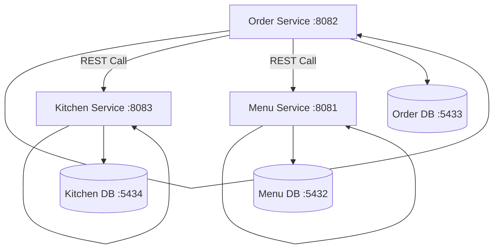

# 🍽️ Resto-Hub Microservices System

A complete Restaurant Management System built with a scalable Microservices Architecture using Spring Boot.

## 📋 Table of Contents
- [Architecture Overview](#architecture-overview)
- [Quick Start](#quick-start)
- [API Endpoints](#api-endpoints)
- [Manual Development](#manual-development)
- [Testing the System](#testing-the-system)

## 🏗️ Architecture Overview

The system consists of independent microservices communicating via REST APIs:

- **Menu Service**: Spring Boot + PostgreSQL (Port 8081) - Manages menu items
- **Order Service**: Spring Boot + PostgreSQL (Port 8082) - Handles customer orders
- **Kitchen Service**: Spring Boot + PostgreSQL (Port 8083) - Manages kitchen operations

### Architecture Diagram



## 🚀 Quick Start

### Prerequisites
- Docker & Docker Compose installed

### Run the Entire System
```bash
docker-compose up --build
```
*First run may take a few minutes to compile all Java applications.*

### Access Points
- **Swagger Documentation**:
    - Menu Service: [http://localhost:8081/swagger-ui.html](http://localhost:8081/swagger-ui.html)
    - Order Service: [http://localhost:8082/swagger-ui.html](http://localhost:8082/swagger-ui.html)
    - Kitchen Service: [http://localhost:8083/swagger-ui.html](http://localhost:8083/swagger-ui.html)

## 🔌 API Endpoints

### Menu Service (`/api/menu`)

Manages restaurant menu items and their availability.

| Method | Endpoint | Description | Request Body | Response |
|--------|----------|-------------|--------------|----------|
| `GET` | `/api/menu/items` | Get all menu items | - | List of menu items |
| `GET` | `/api/menu/items/{id}` | Get specific menu item | - | Menu item details |
| `POST` | `/api/menu/items` | Create new menu item | `MenuItemRequest` | Created menu item |
| `PUT` | `/api/menu/items/{id}` | Update menu item | `MenuItemRequest` | Updated menu item |
| `DELETE` | `/api/menu/items/{id}` | Delete menu item | - | 204 No Content |
| `PATCH` | `/api/menu/items/{id}/availability` | Update item availability | `?available=true/false` | Updated menu item |

**MenuItemRequest Example:**
```json
{
  "name": "Margherita Pizza",
  "description": "Classic Italian pizza",
  "price": 12.99,
  "category": "MAIN_COURSE",
  "available": true
}
```

---

### 📝 Order Service (`/api/orders`)

Handles customer order creation and management. Automatically sends orders to the kitchen service.

| Method | Endpoint | Description | Request Body | Response |
|--------|----------|-------------|--------------|----------|
| `POST` | `/api/orders` | Create new order | `OrderRequest` | Created order with ID |
| `GET` | `/api/orders/{id}` | Get order details | - | Order details |
| `PATCH` | `/api/orders/{id}/status` | Update order status | `?status=PENDING/CONFIRMED/PREPARING/READY/DELIVERED/CANCELLED` | Updated order |

**OrderRequest Example (Dine-In):**
```json
{
  "customerName": "John Doe",
  "customerPhone": "+1234567890",
  "orderType": "DINE_IN",
  "tableNumber": "5",
  "items": [
    {
      "menuItemId": 1,
      "quantity": 2
    },
    {
      "menuItemId": 3,
      "quantity": 1
    }
  ]
}
```

**OrderRequest Example (Delivery):**
```json
{
  "customerName": "Jane Smith",
  "customerPhone": "+1234567890",
  "orderType": "DELIVERY",
  "deliveryAddress": "123 Main St, Apt 4B",
  "items": [
    {
      "menuItemId": 2,
      "quantity": 1
    }
  ]
}
```

---

### 🍳 Kitchen Service (`/api/kitchen`)

Manages kitchen operations and order preparation workflow.

| Method | Endpoint | Description | Request Body | Response |
|--------|----------|-------------|--------------|----------|
| `GET` | `/api/kitchen/orders` | Get all kitchen orders | - | List of all orders |
| `GET` | `/api/kitchen/queue` | Get active orders (not served) | - | List of pending/preparing/ready orders |
| `POST` | `/api/kitchen/orders/{id}/start` | Start preparing an order | - | Order with status `PREPARING` |
| `PUT` | `/api/kitchen/orders/{id}/complete` | Mark order as ready | - | Order with status `READY` |
| `PUT` | `/api/kitchen/orders/{id}/status` | Update order status manually | `?status=PENDING/PREPARING/READY/SERVED` | Updated order |

**Kitchen Order Statuses:**
- `PENDING` - Order received, waiting to be prepared
- `PREPARING` - Order is being prepared
- `READY` - Order is ready for pickup/serving
- `SERVED` - Order has been served to customer

---

## 🛠️ Manual Development

To run services individually for development:

### 1. Start Infrastructure
```bash
docker-compose up -d postgres-menu postgres-order postgres-kitchen
```

### 2. Run Each Service
Each service is a standard Spring Boot application:

**Menu Service:**
```bash
cd menu-service
mvn spring-boot:run
```

**Order Service:**
```bash
cd order-service
mvn spring-boot:run
```

**Kitchen Service:**
```bash
cd kitchen-service
mvn spring-boot:run
```


## 🧪 Testing the System

### Complete Workflow Example

**1. Create a Menu Item**
```bash
curl -X POST http://localhost:8080/api/menu/items \
  -H "Content-Type: application/json" \
  -d '{
    "name": "Burger",
    "description": "Delicious beef burger",
    "price": 10.0,
    "category": "MAIN_COURSE",
    "available": true
  }'
```

**2. Create an Order**
```bash
curl -X POST http://localhost:8080/api/orders \
  -H "Content-Type: application/json" \
  -d '{
    "customerName": "John Doe",
    "orderType": "DINE_IN",
    "tableNumber": "5",
    "items": [
      {
        "menuItemId": 1,
        "quantity": 2
      }
    ]
  }'
```

**3. Check Kitchen Queue**
```bash
curl http://localhost:8080/api/kitchen/queue
```

**4. Start Preparing Order**
```bash
curl -X POST http://localhost:8080/api/kitchen/orders/1/start
```

**5. Mark Order as Ready**
```bash
curl -X PUT http://localhost:8080/api/kitchen/orders/1/complete
```

**6. Get Order Status**
```bash
curl http://localhost:8080/api/orders/1
```

## 📊 Database Ports

Each service has its own PostgreSQL database:

- **Menu Database**: `localhost:5432`
- **Order Database**: `localhost:5433`
- **Kitchen Database**: `localhost:5434`

**Default Credentials:**
- Username: `admin`
- Password: `admin123`

## 🔧 Technology Stack

- **Backend Framework**: Spring Boot 3.2.1
- **Database**: PostgreSQL 15
- **Service Communication**: OpenFeign (REST)
- **Documentation**: SpringDoc OpenAPI (Swagger)
- **Build Tool**: Maven
- **Containerization**: Docker & Docker Compose

## 📝 Notes

- All services use Java 17
- The system uses synchronous REST communication between services
- Each service has its own isolated database
- Swagger UI is available for each service for interactive API testing
